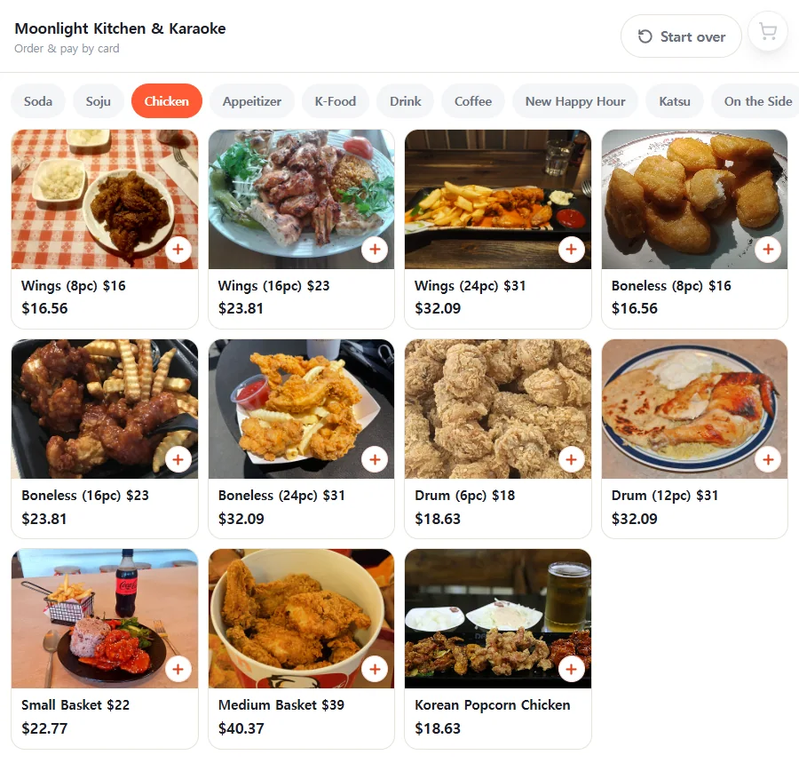
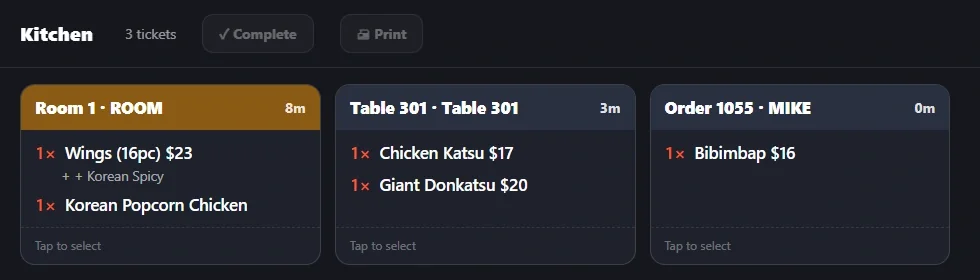
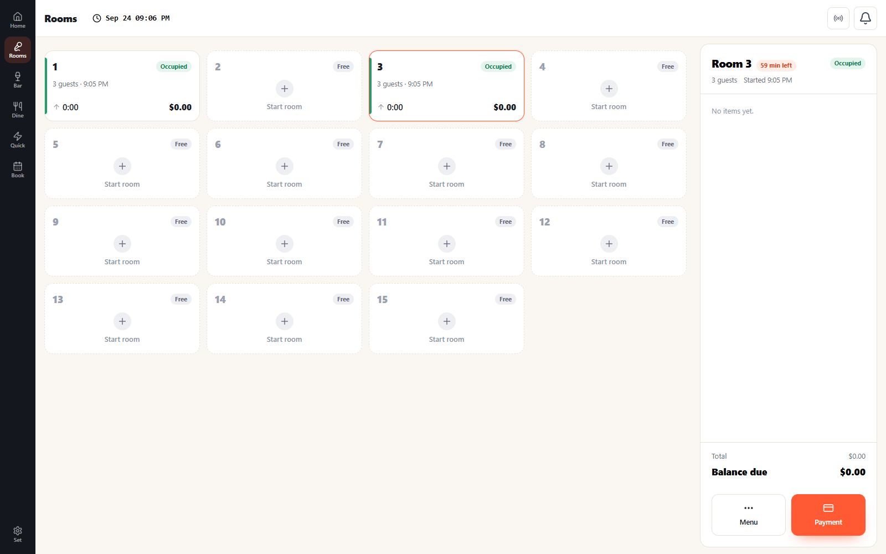
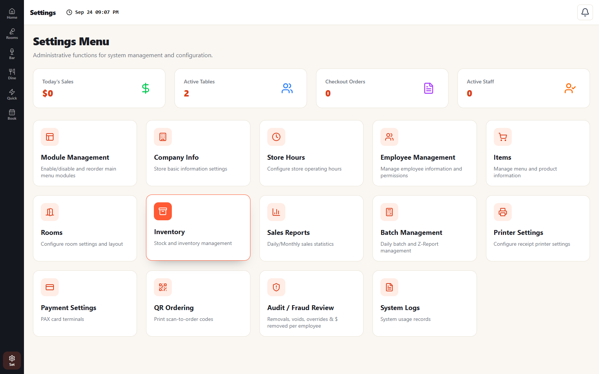
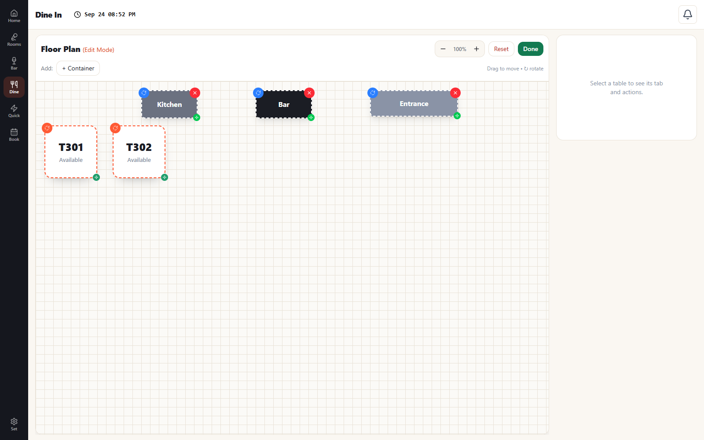

  

<h1 align="center">VenueTap POS — Desktop</h1>

  One point of sale for karaoke rooms, bars, and restaurants — 
  that keeps selling when the internet drops.

  <a href="https://github.com/kyunghoon5/venuetappos-desktop/releases/latest"><b>⬇ Download for Windows</b></a>
  &nbsp;·&nbsp;
  <a href="https://venuetappos.com">Website</a>
  &nbsp;·&nbsp;
  <a href="https://app.venuetappos.com">Open the web POS</a>
  &nbsp;·&nbsp;
  <a href="https://portal.venuetappos.com">Owner portal</a>

---

## Download & install

Grab the latest **`VenueTap-Setup-<version>.exe`** from the [**Releases**](https://github.com/kyunghoon5/venuetappos-desktop/releases/latest) page and run it. Windows 10/11 (64-bit). The app updates itself from then on — no reinstalls.

No Windows machine handy? The same POS runs in your browser at **[app.venuetappos.com](https://app.venuetappos.com)**.

---

## What it does

Install the app on any Windows PC or touchscreen you already own, sign in, and pick what that machine should be — a register, a self-order kiosk, a kitchen display, or a customer-facing display. Bring your own devices; no proprietary hardware lock-in.

### Register POS
Rooms, tables, bar tabs, and quick service in one screen — photo menus, split checks, kitchen routing, and card payments.

### Self-service — kiosk & QR
Any touchscreen becomes a card-only, pay-first kiosk. Every table and room gets a QR code so guests order from their own phone. No app to install.

### Kitchen display
Orders from registers, kiosks, and guest phones land in one queue. Tickets age from green to red, routed to the right printer and station.

### Customer-facing display
A second screen mirrors the register in real time — every line, option, and total, then card prompts, change due, and a thank-you.

### Owner portal & reports
Daily, weekly, and item-rank reports for one store or all of them, from any browser. Excel exports, and owner / manager / viewer roles per store.

### Rooms & floor, your way

**Rooms with live timers** — count-up or count-down billing with per-hour rates by day and time. Each occupied room shows guests, elapsed time, and time remaining at a glance.

**Configure everything from one settings screen** — items and menus, rooms and rates, employees and permissions, receipt/kitchen printers, PAX card payments, QR ordering, and audit / fraud review.

**Drag-and-drop floor plan** — add tables, resize and arrange them, and drop in bar, kitchen, and entrance markers.

---

## Highlights

- **Room timers** for KTV, screen golf, and private event rooms — per-hour rates by day and time, count-up or count-down billing
- **Tables, bar tabs, and quick service** with floor plans and split checks
- **Self-order kiosk** and **QR ordering** feeding the same kitchen
- **Kitchen display (KDS)** with green-to-red ticket aging and per-station routing
- **Customer-facing display** that mirrors the register
- **Keeps selling through internet outages** — one PC runs as an in-store hub; registers keep ringing and tickets keep printing, then everything syncs to the cloud when the connection returns
- **Cloud reporting** across all your locations, with Excel export
- **Updates itself** fleet-wide — new features arrive without a site visit
- Works with **PAX** card terminals and **Epson-compatible** printers

---

## Links

- **Website:** https://venuetappos.com
- **Web POS:** https://app.venuetappos.com
- **Owner portal:** https://portal.venuetappos.com
- **Pricing & demo:** https://venuetappos.com/pricing
- **Support:** support@singsingmedia.com

Currently serving venues in the United States.

## License

[MIT](LICENSE) © VenueTap
